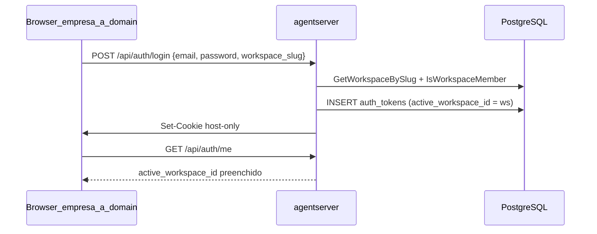

# Plano unificado: Workspace-Scoped Auth (Opção A)

> **Identificador:** `cursor_workspace-subdomain-auth` (documento canônico)  
> **Status:** planejado — não implementado  
> **Design:** [workspace-auth-design.md](../workspace-auth-design.md)  
> **Predecessor:** [workspace-session-auth.md](../workspace-session-auth.md) (PR #53, migration 039)  
> **Mesclado em:** 2026-05-27 — corpo TDD (Tasks 1–11) + addendum frontend/cookie/OIDC (Tasks 12–15)

**Para quem executa:** Use **superpowers:executing-plans** task-by-task. Commits atômicos por task.

**Goal:** Cada workspace tem subdomínio `<slug>.<BASE_DOMAIN>`. Login nesse host fixa `active_workspace_id` no token (sem passo extra de “escolher workspace”).

**Decisões unificadas (2026 × cursor):**

| Tópico | Escolha canônica |
|--------|------------------|
| Auth login | `LoginWithWorkspace` em `internal/auth/auth.go` — `Login` → `SetActiveWorkspace`; se slug/membership falhar → `InvalidateToken` + `ok=false` |
| Slug helpers | `internal/db/slug.go` (não `internal/workspace/`) |
| Migration | `040_workspace_slug.sql` |
| Cookie tenant | Host-only (`Domain` vazio) — ver Task 12 |
| Frontend host | `web/src/lib/hostname.ts` + Vitest (Task 7) |
| Fora de escopo v1 | SSO/SAML (Opção B/C), `GET /api/public/workspaces/{slug}` opcional |

## Escopo e premissas

Opção A (~1 sprint). B/C só no roadmap.

**Já no repo (PR #53):** migration 039, `POST /api/auth/session/workspace`, `GET /api/auth/me`, `SetActiveWorkspace`, `ValidateTokenWithWorkspace`.

**Gap:** `workspaces.slug`, login com `workspace_slug`, cookie host-only explícito, frontend com `active_workspace_id`, OIDC no subdomínio.



## Checklist (todas as tasks)

| Task | Tarefa | Status |
|------|--------|--------|
| 1 | Migration `040_workspace_slug.sql` | pendente |
| 2 | `internal/db/slug.go` + testes | pendente |
| 3 | `GetWorkspaceBySlug` + `Workspace.Slug` | pendente |
| 4 | `CreateWorkspaceWithSlug` | pendente |
| 5 | `LoginWithWorkspace` | pendente |
| 6 | `handleLogin` + `workspace_slug` | pendente |
| 7 | `hostname.ts` + testes Vitest | pendente |
| 8 | Login UI + `workspace_slug` no body | pendente |
| 9 | `handleCreateWorkspace` + slug na API | pendente |
| 10 | Modal criar workspace (slug editável) | pendente |
| 11 | OpenAPI + docs + PR template | pendente |
| 12 | Cookie host-only + logout alinhado | pendente |
| 13 | `getMe` / `setSessionWorkspace` / `App.tsx` / TopBar | pendente |
| 14 | OIDC callback com slug no host | pendente |
| 15 | `ResolveWorkspaceSlugFromHost` + testes + smoke DEV | pendente |

---

# Parte I — Execução TDD (Tasks 1–11)

## Task 1: Migration 040 — workspaces.slug

**Files:**
- Create: `internal/db/migrations/040_workspace_slug.sql`

**Step 1: Write the migration**

```sql
-- 040_workspace_slug.sql — S6-PR1 (workspace-auth-design.md, Opção A)
--
-- Adds workspaces.slug (URL-safe kebab-case identifier) used by
-- subdomain-based login: <slug>.agentserver.com routes to the workspace.
--
-- Backfill: existing rows get slug = lower(regexp_replace(name, '[^a-z0-9-]+', '-', 'g'))
-- with a -2/-3/... suffix on collisions. NOT NULL + UNIQUE enforced AFTER backfill.

ALTER TABLE workspaces ADD COLUMN IF NOT EXISTS slug TEXT;

-- Backfill: deterministic slugify from name with collision handling.
WITH base AS (
    SELECT id,
           regexp_replace(lower(name), '[^a-z0-9]+', '-', 'g') AS raw_slug
    FROM workspaces
    WHERE slug IS NULL
),
trimmed AS (
    SELECT id, trim(both '-' from raw_slug) AS s FROM base
),
numbered AS (
    SELECT id,
           CASE WHEN s = '' THEN 'workspace' ELSE s END AS s,
           row_number() OVER (PARTITION BY CASE WHEN s = '' THEN 'workspace' ELSE s END
                              ORDER BY id) AS rn
    FROM trimmed
)
UPDATE workspaces w
SET slug = CASE WHEN n.rn = 1 THEN n.s ELSE n.s || '-' || (n.rn) END
FROM numbered n
WHERE w.id = n.id;

ALTER TABLE workspaces ALTER COLUMN slug SET NOT NULL;
CREATE UNIQUE INDEX IF NOT EXISTS uniq_workspaces_slug ON workspaces(slug);
```

**Step 2: Verify migration applies to a fresh DB**

Run: `cd internal/db && go test -tags goolm -run TestMigrationsApply -v`
Expected: existing migration test passes (it walks the whole sequence).

**Step 3: Verify backfill on existing rows**

Manual smoke (against `agentserver-db-secret` in dev):
```bash
DEV="--context arn:aws:eks:us-east-1:344729309528:cluster/dev-ti-eks-analytics-platform"
kubectl $DEV exec -n agentserver deploy/agentserver -- /usr/local/bin/agentserver migrate
kubectl $DEV exec -n agentserver deploy/agentserver -c agentserver -- \
  sh -c 'psql "$DATABASE_URL" -c "SELECT id, name, slug FROM workspaces"'
```
Expected: every row has a non-null slug; collisions get `-2`, `-3`.

**Step 4: Commit**

```bash
git add internal/db/migrations/040_workspace_slug.sql
git commit -m "feat(db): workspaces.slug for subdomain-based auth (S6-PR1 step 1)"
```

---

## Task 2: Slug validator (kebab-case + reserved words)

**Files:**
- Create: `internal/db/slug.go`
- Test: `internal/db/slug_test.go`

**Step 1: Write the failing test**

```go
package db

import "testing"

func TestValidateSlug(t *testing.T) {
    cases := []struct {
        name    string
        in      string
        wantErr bool
    }{
        {"valid kebab", "empresa-a", false},
        {"valid lowercase", "acme", false},
        {"valid with digits", "foo-1", false},
        {"single char", "a", true},          // min 2 chars
        {"too long", string(make([]byte, 64)), true},
        {"uppercase", "Empresa-A", true},
        {"underscore", "empresa_a", true},
        {"leading hyphen", "-empresa", true},
        {"trailing hyphen", "empresa-", true},
        {"double hyphen", "empresa--a", true},
        {"reserved www", "www", true},
        {"reserved api", "api", true},
        {"reserved admin", "admin", true},
        {"reserved app", "app", true},
        {"reserved claw-prefix", "claw-foo", true},
        {"reserved hermes-prefix", "hermes-bar", true},
        {"empty", "", true},
    }
    for _, tc := range cases {
        t.Run(tc.name, func(t *testing.T) {
            err := ValidateSlug(tc.in)
            if (err != nil) != tc.wantErr {
                t.Fatalf("ValidateSlug(%q) err=%v, wantErr=%v", tc.in, err, tc.wantErr)
            }
        })
    }
}

func TestSlugify(t *testing.T) {
    cases := map[string]string{
        "Empresa A":           "empresa-a",
        "  Acme   Corp  ":     "acme-corp",
        "Foo_Bar.Baz":         "foo-bar-baz",
        "Mañana":              "ma-ana", // non-ASCII collapsed
        "":                    "workspace",
        "---":                 "workspace",
    }
    for in, want := range cases {
        if got := Slugify(in); got != want {
            t.Fatalf("Slugify(%q)=%q, want %q", in, got, want)
        }
    }
}
```

**Step 2: Run to verify fail**

Run: `cd internal/db && go test -tags goolm -run "TestValidateSlug|TestSlugify" -v`
Expected: FAIL — `ValidateSlug`/`Slugify` undefined.

**Step 3: Write minimal implementation**

```go
package db

import (
    "fmt"
    "regexp"
    "strings"
)

const (
    minSlugLen = 2
    maxSlugLen = 63
)

var (
    slugRe         = regexp.MustCompile(`^[a-z0-9]+(-[a-z0-9]+)*$`)
    nonAlnumRe     = regexp.MustCompile(`[^a-z0-9]+`)
    reservedSlugs  = map[string]struct{}{
        "www": {}, "api": {}, "admin": {}, "app": {},
        "root": {}, "auth": {}, "login": {}, "register": {},
        "static": {}, "assets": {}, "agentserver": {},
        "openclaw": {}, "hermes": {},
    }
    reservedPrefixes = []string{"claw-", "hermes-"}
)

// ValidateSlug rejects slugs that wouldn't be safe as a subdomain label.
func ValidateSlug(s string) error {
    if len(s) < minSlugLen || len(s) > maxSlugLen {
        return fmt.Errorf("slug must be %d-%d chars", minSlugLen, maxSlugLen)
    }
    if !slugRe.MatchString(s) {
        return fmt.Errorf("slug must be lowercase kebab-case (a-z, 0-9, -)")
    }
    if _, reserved := reservedSlugs[s]; reserved {
        return fmt.Errorf("%q is reserved", s)
    }
    for _, p := range reservedPrefixes {
        if strings.HasPrefix(s, p) {
            return fmt.Errorf("slugs starting with %q are reserved (sandbox subdomain prefix)", p)
        }
    }
    return nil
}

// Slugify converts an arbitrary name to a candidate slug. The result is
// guaranteed to be a kebab-case string, but it is NOT guaranteed unique
// nor non-reserved — callers must run ValidateSlug + uniqueness checks.
func Slugify(name string) string {
    s := strings.ToLower(strings.TrimSpace(name))
    s = nonAlnumRe.ReplaceAllString(s, "-")
    s = strings.Trim(s, "-")
    if s == "" {
        return "workspace"
    }
    return s
}
```

**Step 4: Run to verify pass**

Run: `cd internal/db && go test -tags goolm -run "TestValidateSlug|TestSlugify" -v`
Expected: PASS (all subtests).

**Step 5: Commit**

```bash
git add internal/db/slug.go internal/db/slug_test.go
git commit -m "feat(db): slug validator + slugify helper (S6-PR1 step 2)"
```

---

## Task 3: Workspace.Slug field + GetWorkspaceBySlug

**Files:**
- Modify: `internal/db/workspaces.go`
- Test: `internal/db/workspaces_slug_test.go`

**Step 1: Write the failing test**

```go
package db

import "testing"

func TestGetWorkspaceBySlug(t *testing.T) {
    db := setupTestDB(t) // existing helper in db tests
    defer db.Close()

    // seed
    if err := db.CreateWorkspace("w-1", "Empresa A", ""); err != nil {
        t.Fatal(err)
    }
    if _, err := db.Exec("UPDATE workspaces SET slug = $1 WHERE id = $2", "empresa-a", "w-1"); err != nil {
        t.Fatal(err)
    }

    got, err := db.GetWorkspaceBySlug("empresa-a")
    if err != nil {
        t.Fatalf("GetWorkspaceBySlug err: %v", err)
    }
    if got == nil || got.ID != "w-1" || got.Slug != "empresa-a" {
        t.Fatalf("unexpected result: %+v", got)
    }

    missing, err := db.GetWorkspaceBySlug("does-not-exist")
    if err != nil {
        t.Fatalf("missing slug should not error, got %v", err)
    }
    if missing != nil {
        t.Fatalf("missing slug should return nil, got %+v", missing)
    }
}
```

**Step 2: Run to verify fail**

Run: `cd internal/db && TEST_DATABASE_URL=$TEST_DATABASE_URL go test -tags goolm -run TestGetWorkspaceBySlug -v`
Expected: FAIL — `GetWorkspaceBySlug` undefined; `Workspace.Slug` undefined.

**Step 3: Add Slug field to Workspace struct and helper**

In `internal/db/workspaces.go`:

```go
type Workspace struct {
    ID                     string
    Name                   string
    Slug                   string // NEW — kebab-case unique
    K8sNamespace           sql.NullString
    ChannelRoutingStrategy string
    CreatedAt              time.Time
    UpdatedAt              time.Time
}

func (db *DB) GetWorkspaceBySlug(slug string) (*Workspace, error) {
    if slug == "" {
        return nil, nil
    }
    row := db.QueryRow(`
        SELECT id, name, slug, k8s_namespace, channel_routing_strategy,
               created_at, updated_at
        FROM workspaces
        WHERE slug = $1
    `, slug)
    var w Workspace
    if err := row.Scan(&w.ID, &w.Name, &w.Slug, &w.K8sNamespace,
        &w.ChannelRoutingStrategy, &w.CreatedAt, &w.UpdatedAt); err != nil {
        if err == sql.ErrNoRows {
            return nil, nil
        }
        return nil, fmt.Errorf("scan workspace by slug: %w", err)
    }
    return &w, nil
}
```

Update every existing `SELECT ... FROM workspaces` to include the `slug` column and scan into `&w.Slug`. Run `grep -n "FROM workspaces" internal/db/workspaces.go` to find them all.

**Step 4: Run to verify pass**

Run: `cd internal/db && TEST_DATABASE_URL=$TEST_DATABASE_URL go test -tags goolm -run TestGetWorkspaceBySlug -v`
Expected: PASS.

**Step 5: Commit**

```bash
git add internal/db/workspaces.go internal/db/workspaces_slug_test.go
git commit -m "feat(db): Workspace.Slug + GetWorkspaceBySlug (S6-PR1 step 3)"
```

---

## Task 4: CreateWorkspace generates slug

**Files:**
- Modify: `internal/db/workspaces.go` (`CreateWorkspace` signature)
- Test: `internal/db/workspaces_slug_test.go` (add cases)

**Step 1: Write the failing test**

```go
func TestCreateWorkspaceAssignsSlug(t *testing.T) {
    db := setupTestDB(t)
    defer db.Close()

    id := "w-create-slug"
    slug, err := db.CreateWorkspaceWithSlug(id, "Empresa de Teste", "")
    if err != nil {
        t.Fatal(err)
    }
    if slug != "empresa-de-teste" {
        t.Fatalf("slug = %q, want empresa-de-teste", slug)
    }

    // Collision → suffix -2
    slug2, err := db.CreateWorkspaceWithSlug("w-collide", "Empresa de Teste", "")
    if err != nil {
        t.Fatal(err)
    }
    if slug2 != "empresa-de-teste-2" {
        t.Fatalf("collision slug = %q, want empresa-de-teste-2", slug2)
    }
}
```

**Step 2: Run to verify fail**

Run: `cd internal/db && TEST_DATABASE_URL=$TEST_DATABASE_URL go test -tags goolm -run TestCreateWorkspaceAssignsSlug -v`
Expected: FAIL — `CreateWorkspaceWithSlug` undefined.

**Step 3: Add CreateWorkspaceWithSlug**

```go
// CreateWorkspaceWithSlug creates a workspace with an auto-generated slug
// derived from name. On collision, suffixes -2, -3, ... until unique.
// Returns the final slug.
func (db *DB) CreateWorkspaceWithSlug(id, name, k8sNamespace string) (string, error) {
    base := Slugify(name)
    if err := ValidateSlug(base); err != nil {
        // base hit a reserved name — append numeric suffix to escape
        base = base + "-1"
    }
    slug := base
    for i := 2; ; i++ {
        existing, err := db.GetWorkspaceBySlug(slug)
        if err != nil {
            return "", err
        }
        if existing == nil {
            break
        }
        slug = fmt.Sprintf("%s-%d", base, i)
        if i > 1000 {
            return "", fmt.Errorf("could not allocate unique slug for %q", name)
        }
    }
    var ns sql.NullString
    if k8sNamespace != "" {
        ns = sql.NullString{String: k8sNamespace, Valid: true}
    }
    _, err := db.Exec(`
        INSERT INTO workspaces (id, name, slug, k8s_namespace, created_at, updated_at)
        VALUES ($1, $2, $3, $4, NOW(), NOW())
    `, id, name, slug, ns)
    if err != nil {
        return "", err
    }
    return slug, nil
}
```

Leave the old `CreateWorkspace` intact for backwards compatibility — but have it call the slug-aware variant under the hood:

```go
func (db *DB) CreateWorkspace(id, name, k8sNamespace string) error {
    _, err := db.CreateWorkspaceWithSlug(id, name, k8sNamespace)
    return err
}
```

**Step 4: Run to verify pass**

Run: `cd internal/db && TEST_DATABASE_URL=$TEST_DATABASE_URL go test -tags goolm -run TestCreateWorkspaceAssignsSlug -v`
Expected: PASS.

**Step 5: Commit**

```bash
git add internal/db/workspaces.go internal/db/workspaces_slug_test.go
git commit -m "feat(db): CreateWorkspaceWithSlug with collision suffix (S6-PR1 step 4)"
```

---

## Task 5: Auth.LoginWithWorkspace

**Files:**
- Modify: `internal/auth/auth.go`
- Test: `internal/auth/auth_test.go`

**Step 1: Write the failing test**

```go
func TestLoginWithWorkspace(t *testing.T) {
    a, _ := newTestAuth(t) // existing helper
    // Setup: user + 2 workspaces, user is member of A only.
    a.Register("u-1", "alice@empresa-a.com", "pw123")
    a.db.CreateWorkspaceWithSlug("w-a", "Empresa A", "")
    a.db.CreateWorkspaceWithSlug("w-b", "Empresa B", "")
    a.db.AddWorkspaceMember("w-a", "u-1", "owner")

    t.Run("login with member workspace stamps active_workspace_id", func(t *testing.T) {
        token, userID, ok := a.LoginWithWorkspace("alice@empresa-a.com", "pw123", "empresa-a")
        if !ok || userID != "u-1" || token == "" {
            t.Fatalf("login failed: ok=%v userID=%q", ok, userID)
        }
        _, ws, _ := a.ValidateTokenWithWorkspace(token)
        if ws != "w-a" {
            t.Fatalf("active_workspace_id = %q, want w-a", ws)
        }
    })

    t.Run("login with non-member workspace fails", func(t *testing.T) {
        _, _, ok := a.LoginWithWorkspace("alice@empresa-a.com", "pw123", "empresa-b")
        if ok {
            t.Fatal("login should fail for non-member workspace")
        }
    })

    t.Run("login with unknown slug fails", func(t *testing.T) {
        _, _, ok := a.LoginWithWorkspace("alice@empresa-a.com", "pw123", "does-not-exist")
        if ok {
            t.Fatal("login should fail for unknown slug")
        }
    })

    t.Run("empty slug falls back to plain Login (no workspace stamp)", func(t *testing.T) {
        token, _, ok := a.LoginWithWorkspace("alice@empresa-a.com", "pw123", "")
        if !ok {
            t.Fatal("login with empty slug should succeed")
        }
        _, ws, _ := a.ValidateTokenWithWorkspace(token)
        if ws != "" {
            t.Fatalf("expected empty active_workspace_id, got %q", ws)
        }
    })
}
```

**Step 2: Run to verify fail**

Run: `cd internal/auth && TEST_DATABASE_URL=$TEST_DATABASE_URL go test -tags goolm -run TestLoginWithWorkspace -v`
Expected: FAIL — `LoginWithWorkspace` undefined.

**Step 3: Add LoginWithWorkspace**

```go
// LoginWithWorkspace verifies credentials and, if workspaceSlug is non-empty,
// resolves the slug and stamps active_workspace_id on the new session token.
// Returns (token, userID, ok) — ok=false on bad credentials OR non-member OR
// unknown slug. Caller cannot distinguish (deliberate — don't leak slug existence).
func (a *Auth) LoginWithWorkspace(email, password, workspaceSlug string) (string, string, bool) {
    token, userID, ok := a.Login(email, password)
    if !ok {
        return "", "", false
    }
    if workspaceSlug == "" {
        return token, userID, true
    }
    ws, err := a.db.GetWorkspaceBySlug(workspaceSlug)
    if err != nil || ws == nil {
        // Invalidate the freshly-issued token so the caller doesn't get a
        // valid session for a non-existent / non-member workspace.
        _ = a.InvalidateToken(token)
        return "", "", false
    }
    bound, err := a.SetActiveWorkspace(token, userID, ws.ID)
    if err != nil || !bound {
        _ = a.InvalidateToken(token)
        return "", "", false
    }
    return token, userID, true
}
```

**Step 4: Run to verify pass**

Run: `cd internal/auth && TEST_DATABASE_URL=$TEST_DATABASE_URL go test -tags goolm -run TestLoginWithWorkspace -v`
Expected: PASS (all 4 subtests).

**Step 5: Commit**

```bash
git add internal/auth/auth.go internal/auth/auth_test.go
git commit -m "feat(auth): LoginWithWorkspace — slug-bound session at login (S6-PR1 step 5)"
```

---

## Task 6: HTTP handler accepts workspace_slug

**Files:**
- Modify: `internal/server/api_types.go`
- Modify: `internal/server/server.go` (`handleLogin`)
- Test: `internal/server/auth_test.go` (or wherever existing login handler tests live)

**Step 1: Add workspace_slug to AuthCredentials**

In `internal/server/api_types.go`:

```go
// AuthCredentials is the email+password body for POST /api/auth/login
type AuthCredentials struct {
    Email         string `json:"email"`
    Password      string `json:"password"`
    WorkspaceSlug string `json:"workspace_slug,omitempty"` // NEW — optional
} //@name AuthCredentials
```

**Step 2: Write the failing handler test**

```go
func TestHandleLoginWorkspaceSlug(t *testing.T) {
    srv := newTestServer(t)
    // seed: user member of empresa-a only
    srv.auth.Register("u-1", "alice@x.com", "pw")
    srv.db.CreateWorkspaceWithSlug("w-a", "Empresa A", "")
    srv.db.AddWorkspaceMember("w-a", "u-1", "owner")

    // happy path
    body, _ := json.Marshal(map[string]string{
        "email": "alice@x.com", "password": "pw", "workspace_slug": "empresa-a",
    })
    rr := httptest.NewRecorder()
    req := httptest.NewRequest("POST", "/api/auth/login", bytes.NewReader(body))
    srv.handleLogin(rr, req)
    if rr.Code != 200 {
        t.Fatalf("status=%d, want 200; body=%s", rr.Code, rr.Body)
    }
    cookie := rr.Result().Cookies()[0]
    _, ws, _ := srv.auth.ValidateTokenWithWorkspace(cookie.Value)
    if ws != "w-a" {
        t.Fatalf("active_workspace_id = %q, want w-a", ws)
    }

    // non-member → 401
    body2, _ := json.Marshal(map[string]string{
        "email": "alice@x.com", "password": "pw", "workspace_slug": "empresa-b",
    })
    rr2 := httptest.NewRecorder()
    srv.handleLogin(rr2, httptest.NewRequest("POST", "/api/auth/login", bytes.NewReader(body2)))
    if rr2.Code != 401 {
        t.Fatalf("non-member status=%d, want 401", rr2.Code)
    }
}
```

**Step 3: Run to verify fail**

Run: `cd internal/server && TEST_DATABASE_URL=$TEST_DATABASE_URL go test -tags goolm -run TestHandleLoginWorkspaceSlug -v`
Expected: FAIL — handler still calls `Auth.Login` ignoring slug.

**Step 4: Patch handler**

In `internal/server/server.go::handleLogin`, replace:

```go
token, _, ok := s.Auth.Login(req.Email, req.Password)
```

with:

```go
token, _, ok := s.Auth.LoginWithWorkspace(req.Email, req.Password, req.WorkspaceSlug)
```

**Step 5: Run to verify pass**

Run: `cd internal/server && TEST_DATABASE_URL=$TEST_DATABASE_URL go test -tags goolm -run TestHandleLoginWorkspaceSlug -v`
Expected: PASS.

**Step 6: Regen OpenAPI + API reference**

Run: `make openapi && make api-docs`
Expected: `docs/api/openapi.yaml` gains the `workspace_slug` field on `AuthCredentials`.

**Step 7: Commit**

```bash
git add internal/server/api_types.go internal/server/server.go \
        internal/server/auth_test.go docs/api/openapi.{yaml,json} docs/api/reference/
git commit -m "feat(server): /api/auth/login accepts workspace_slug (S6-PR1 step 6)"
```

---

## Task 7: Frontend — Login reads hostname + injects slug

**Files:**
- Modify: `web/src/lib/api.ts` (login function + types)
- Modify: `web/src/components/Login.tsx`

**Step 1: Inspect existing login call shape**

Run: `grep -n "auth/login\|workspace_slug" web/src/lib/api.ts web/src/components/Login.tsx`
Use the output to scope the edits. Login currently posts `{ email, password }`.

**Step 2: Extract hostname helper**

Create `web/src/lib/hostname.ts`:

```ts
// extractWorkspaceSlug parses the first label of the hostname and returns
// it when it does NOT match a reserved root (the marketing/root host) or
// a sandbox subdomain (claw-*, hermes-*). Returns "" when the URL is the
// bare root host or a sandbox subdomain — those don't bind a workspace.
const ROOT_HOSTS = new Set([
  "agentserver.analytics.vtex.com",
  "localhost",
  "127.0.0.1",
]);

export function extractWorkspaceSlug(host: string): string {
  const bare = host.split(":")[0];
  if (ROOT_HOSTS.has(bare)) return "";
  const first = bare.split(".")[0];
  if (first.startsWith("claw-") || first.startsWith("hermes-")) return "";
  // additional safety: a single label without dots is local dev → no slug
  if (!bare.includes(".")) return "";
  return first;
}
```

Add a Vitest test next to it (`web/src/lib/hostname.test.ts`):

```ts
import { describe, it, expect } from "vitest";
import { extractWorkspaceSlug } from "./hostname";

describe("extractWorkspaceSlug", () => {
  it("returns slug for tenant subdomain", () => {
    expect(extractWorkspaceSlug("empresa-a.agentserver.analytics.vtex.com")).toBe("empresa-a");
  });
  it("returns empty for root host", () => {
    expect(extractWorkspaceSlug("agentserver.analytics.vtex.com")).toBe("");
  });
  it("returns empty for sandbox subdomain", () => {
    expect(extractWorkspaceSlug("claw-x1ya2cbn.agentserver.analytics.vtex.com")).toBe("");
    expect(extractWorkspaceSlug("hermes-foo.agentserver.analytics.vtex.com")).toBe("");
  });
  it("returns empty for localhost", () => {
    expect(extractWorkspaceSlug("localhost")).toBe("");
    expect(extractWorkspaceSlug("localhost:5173")).toBe("");
  });
});
```

**Step 3: Run to verify pass**

Run: `cd web && pnpm test hostname`
Expected: PASS (4 cases).

**Step 4: Wire into login**

In `web/src/lib/api.ts`, extend the login call:

```ts
export async function login(email: string, password: string, workspaceSlug?: string) {
  return apiFetch("/api/auth/login", {
    method: "POST",
    body: JSON.stringify({
      email,
      password,
      ...(workspaceSlug ? { workspace_slug: workspaceSlug } : {}),
    }),
  });
}
```

In `web/src/components/Login.tsx`, on the form submit:

```tsx
import { extractWorkspaceSlug } from "../lib/hostname";

// inside the submit handler:
const slug = extractWorkspaceSlug(window.location.hostname);
await login(email, password, slug);
```

Add a small banner above the form when slug is present:

```tsx
{slug && (
  <div className="text-sm text-muted-foreground mb-2">
    Signing in to workspace <code>{slug}</code>
  </div>
)}
```

**Step 5: Build the frontend to check for type errors**

Run: `cd web && pnpm build`
Expected: build succeeds.

**Step 6: Commit**

```bash
git add web/src/lib/hostname.ts web/src/lib/hostname.test.ts \
        web/src/lib/api.ts web/src/components/Login.tsx
git commit -m "feat(ui): login reads workspace slug from subdomain (S6-PR1 step 7)"
```

---

## Task 8: Workspace creation UI — slug field

**Files:**
- Modify: `web/src/components/Workspace*` (the create modal — find via grep)
- Modify: any backend handler that creates workspaces (POST /api/workspaces)

**Step 1: Locate the create endpoint and modal**

```bash
grep -n "POST.*workspaces\b\|handleCreateWorkspace\|WorkspaceCreate" \
  internal/server/server.go web/src/components/*.tsx
```

**Step 2: Backend — accept optional slug from request body**

In the create-workspace handler, accept an optional `slug` field. If provided, call `ValidateSlug` then `CreateWorkspaceWithSlug` (slug-aware), passing an explicit slug into a new path. Otherwise auto-derive from name.

Add a test that POSTing without slug derives from name, and POSTing with explicit slug validates it.

**Step 3: Frontend — show slug input with auto-fill from name**

In the create modal:
- Text input "Workspace name"
- Read-only / editable input "URL slug" pre-filled by `slugify(name)` client-side as the user types
- On submit POST `{ name, slug }`

A simple client-side `slugify` mirroring the server's lowercase + hyphenate rule keeps the preview honest.

**Step 4: Run frontend tests**

Run: `cd web && pnpm test`
Expected: existing tests pass.

**Step 5: Commit**

```bash
git add internal/server/server.go internal/server/*_test.go \
        web/src/components/Workspace*.tsx web/src/lib/api.ts
git commit -m "feat: workspace create UI exposes editable slug (S6-PR1 step 8)"
```

---

## Task 9: Reserved root domain handling

**Files:**
- Modify: `web/src/components/Login.tsx` (or routing entry)
- Optionally: Ingress in `deploy/helm/agentserver/templates/ingress.yaml`

**Step 1: Decide bare-host behavior**

Two options for `agentserver.analytics.vtex.com/login` (no slug):
- **A.** Keep current behavior — log in globally, then user picks workspace (PR #53 flow). Subdomain is only a shortcut.
- **B.** Redirect to a "choose a workspace" page that lists the user's memberships and routes to `<slug>.agentserver...` on click.

**Pick A for now** — minimal change. The bare host stays exactly as is, only subdomain-aware logins get the slug stamp.

**Step 2: Add a smoke note in `docs/workspace-auth-design.md`**

Append a "Status v1" section noting that only subdomain logins set `active_workspace_id` at login; bare-host login falls back to PR #53's explicit selection.

**Step 3: Commit**

```bash
git add docs/workspace-auth-design.md
git commit -m "docs: clarify bare-host fallback for subdomain auth (S6-PR1 step 9)"
```

---

## Task 10: End-to-end manual smoke

**Step 1: Deploy to DEV**

Re-tag the agentserver image with `auth-slug`, push to ECR, helm upgrade:

```bash
DEV_CTX="arn:aws:eks:us-east-1:344729309528:cluster/dev-ti-eks-analytics-platform"

docker build --platform linux/amd64 \
  -t 344729309528.dkr.ecr.us-east-1.amazonaws.com/agentserver:auth-slug .
docker push 344729309528.dkr.ecr.us-east-1.amazonaws.com/agentserver:auth-slug

# bump tag in values-dev-eks.yaml then:
helm --kube-context "$DEV_CTX" upgrade --install agentserver ./deploy/helm/agentserver \
  -n agentserver -f values-dev-eks.yaml
```

Expected: rev bump, migration 040 applied (check pod logs).

**Step 2: Verify a slug-bound login**

Backfilled workspaces have slugs derived from names. Pick one:

```bash
kubectl --context "$DEV_CTX" exec -n agentserver deploy/agentserver -c agentserver -- \
  sh -c 'psql "$DATABASE_URL" -c "SELECT slug FROM workspaces LIMIT 5"'
```

Open `https://<one-of-those-slugs>.agentserver.analytics.vtex.com/login` in the browser.
Expected:
- Banner shows "Signing in to workspace <slug>"
- After login, `GET /api/auth/me` returns the workspace id in `active_workspace_id`

**Step 3: Verify non-member rejection**

Create a second user via the bare host, then try logging in from a workspace they're not a member of via the subdomain — expect 401.

**Step 4: Commit (if doc updates accumulated during smoke)**

```bash
git add docs/dev-eks-deploy.md
git commit -m "docs(dev-eks): subdomain auth smoke notes (S6-PR1 step 10)"
```

---

## Task 11: PR

**Step 1: Push branch + open PR**

```bash
git push -u origin feat/workspace-subdomain-auth
gh pr create --title "feat(auth): workspace-scoped login via subdomain (S6-PR1)" \
  --body "$(cat <<'EOF'
## Summary

Implements Opção A from \`docs/workspace-auth-design.md\` — each workspace
gets a unique \`slug\` (kebab-case, validated, reserved-name-protected).
Login from \`<slug>.agentserver.analytics.vtex.com\` is bound to that
workspace and the session token is stamped with \`active_workspace_id\`
at issue time, removing the separate "select workspace" round trip.

Bare-host login continues to work and falls back to PR #53's explicit
\`POST /api/auth/session/workspace\`. Sandbox subdomains (\`claw-*\`,
\`hermes-*\`) are reserved against the slug namespace.

## Migrations

- 040: \`workspaces.slug\` (NOT NULL UNIQUE), backfilled deterministically.

## Test plan

- [x] \`go test -tags goolm ./internal/...\` passes (unit + integration)
- [x] \`pnpm test\` passes
- [x] \`make openapi && make api-docs\` regen clean
- [ ] Smoke in DEV — subdomain login → \`/api/auth/me.active_workspace_id\`
- [ ] Smoke in DEV — non-member subdomain login returns 401
- [ ] Smoke in DEV — workspace create UI surfaces editable slug

🤖 Generated with [Claude Code](https://claude.com/claude-code)
EOF
)"
```

**Step 2: Verify CI green, then merge**

Wait for `test`, `web-build`, and `OpenAPI drift check` to pass. Merge with squash or merge commit per project convention.

---

# Parte II — Addendum (Tasks 12–15)

Itens do plano estratégico que não estavam detalhados nas Tasks 1–11. Executar **após** Task 6 (login backend) e em paralelo com Tasks 7–10 quando possível.

## Task 12: Cookie host-only no tenant

**Objetivo:** Sessão de `empresa-a.<BASE_DOMAIN>` não vaza para `empresa-b.<BASE_DOMAIN>` nem para apex via `AGENTSERVER_COOKIE_DOMAIN`.

**Arquivos:** `internal/auth/auth.go` (`SetTokenCookie`, `ClearTokenCookie`), `internal/server/server.go` (`handleLogin`, `handleLogout`).

**Comportamento:**

| Cenário | Cookie `Domain` |
|---------|-----------------|
| Login com `workspace_slug` (subdomínio tenant) | vazio → host-only |
| Login no apex (sem slug) | `AGENTSERVER_COOKIE_DOMAIN` se setado (atual) |
| Logout | mesmo critério usado no `Set-Cookie` |

**Passos:**

1. Teste: após login com slug, inspecionar `Set-Cookie` — sem atributo `Domain`.
2. Se hoje `SetTokenCookie` sempre seta `Domain` do env, adicionar parâmetro `hostOnly bool` ou `SetTokenCookieHostOnly(w, token)`.
3. `handleLogin`: se `workspace_slug != ""` **ou** slug inferido do `Host` → host-only.
4. Documentar trade-off com codex-auth cross-subdomain em `docs/workspace-session-auth.md`.

**Commit sugerido:** `fix(auth): host-only session cookie on tenant subdomain login`

---

## Task 13: Frontend — sessão e UI por `active_workspace_id`

**Objetivo:** Substituir dependência só de `selectedWorkspaceId` (client) pelo workspace ativo da sessão após login no subdomínio.

**Arquivos:**

- `web/src/lib/api.ts` — `getMe()` tipar `active_workspace_id`; `setSessionWorkspace(id)` (já existe no backend PR #53)
- `web/src/App.tsx` — após auth: se `me.active_workspace_id` → navegar `/w/{id}` e fixar workspace; senão fluxo picker atual
- `web/src/components/TopBar.tsx` — se `isTenantSubdomain()` (de `hostname.ts`): **ocultar** workspace switcher
- `web/src/lib/workspaceHost.ts` (opcional alias): re-export de `hostname.ts` para legibilidade

**Passos:**

1. Após `login()` bem-sucedido, chamar `getMe()` e persistir `active_workspace_id` no estado global (mesmo padrão de `selectedWorkspaceId` ou substituir quando preenchido).
2. Rotas: garantir que APIs usam workspace da sessão onde aplicável (handlers já validam token + workspace).
3. Apex: manter picker + `POST /api/auth/session/workspace`.
4. Teste manual: subdomínio → login → sem picker; apex → login → picker.

**Commit sugerido:** `feat(web): bind UI to active_workspace_id on tenant subdomain`

---

## Task 14: OIDC no subdomínio

**Objetivo:** SSO no host `empresa-a.<BASE_DOMAIN>` também grava `active_workspace_id` no token novo.

**Arquivos:** `internal/server/server.go` (callback OIDC/GitHub), possivelmente `internal/auth/oidc` ou handler existente.

**Passos:**

1. Após emitir token no callback OAuth, chamar `ResolveWorkspaceSlugFromHost(r.Host, baseDomains)`.
2. Se slug não vazio: `GetWorkspaceBySlug` + `IsWorkspaceMember` → `SetActiveWorkspace`; se não membro → falhar login (mesma política que password).
3. Cookie: host-only quando callback veio de subdomínio tenant (Task 12).
4. **Follow-up aceitável:** PR separado se callback hoje só roda no apex — documentar limitação até merge.

**Commit sugerido:** `feat(auth): stamp active_workspace on OIDC callback for tenant host`

---

## Task 15: `ResolveWorkspaceSlugFromHost` + verificação final

**Backend:** `internal/server/server.go` (ou `internal/db/slug.go`):

```go
// ResolveWorkspaceSlugFromHost returns the first label when host is <slug>.<baseDomain>.
// Returns "" on apex. Ignores claw-*, hermes-*, codex-auth hosts.
func ResolveWorkspaceSlugFromHost(host string, baseDomains []string) string
```

**Testes:** `internal/server/host_workspace_test.go` — apex, tenant válido, `claw-foo`, `hermes-bar`, base domain multi-label.

**Políticas adicionais:**

- **Register** com `workspace_slug` no body: recomendação v1 — `403` ou ignorar slug (só convite/membership).
- **`GET /api/public/workspaces/{slug}`:** opcional; não bloquear Opção A.

**Verificação manual (checklist completo):**

- [ ] Apex: login sem slug → `active_workspace_id` null; picker funciona
- [ ] `{slug}.dev.domain/login`: membro → cookie host-only, `GET /me` com workspace correto
- [ ] Credenciais válidas, não-membro → `401` + `invalid credentials` (sem vazar slug)
- [ ] Slug reservado `api` / prefixo `claw-` rejeitado na **criação** (409/400), não no login
- [ ] Slug duplicado na criação → 409
- [ ] `make openapi-check` + `go test -tags goolm ./...` + `cd web && pnpm test`
- [ ] Smoke DEV conforme `docs/dev-eks.md` (Task 10)

**Roadmap pós-Opção A**

| Fase | Conteúdo |
|------|----------|
| B | `workspace_sso_configs`, SSO initiate/callback, admin UI |
| C | B + A + fallback senha |
| Session v2 | Handlers usam `ActiveWorkspaceFromContext` |
| Emails | Links com subdomínio do workspace |

**Riscos**

1. Cookie host-only vs codex-auth SSO no apex — documentar.
2. OIDC sem Task 14: password no tenant OK, SSO no tenant incompleto até patch.
3. Usuários multi-workspace: um login por subdomínio (esperado B2B).

---

## Notes for the executing engineer

- **Read PR #53 first** (`docs/workspace-session-auth.md` + the `worktree-auth` branch). This plan reuses `SetActiveWorkspace` and `ValidateTokenWithWorkspace` from that PR.
- **The `TEST_DATABASE_URL` env var** is required for integration tests. CI sets it via the postgres service; locally run `make test-db` (or look at `internal/db/testdb.go` for the helper).
- **Slug validation lives in two places** by design — server (`internal/db/slug.go`, authoritative) and client (`web/src/lib/api.ts` for live preview only). Keep them in sync; only the server's check rejects requests.
- **Don't loosen `ROOT_HOSTS`** in `web/src/lib/hostname.ts` without a corresponding backend test — a wrong root host can silently leak the slug.
- **Audit the cookie scope** during smoke. The session cookie must be host-only (`Domain` attr unset) so a session for `empresa-a.agentserver.com` cannot be replayed against `empresa-b.agentserver.com`. The current `auth.SetTokenCookie` does NOT set `Domain`, which is correct — verify it stays that way.
- **Do not implement SSO in this PR.** That's Opção B in the design doc and is intentionally out of scope.
